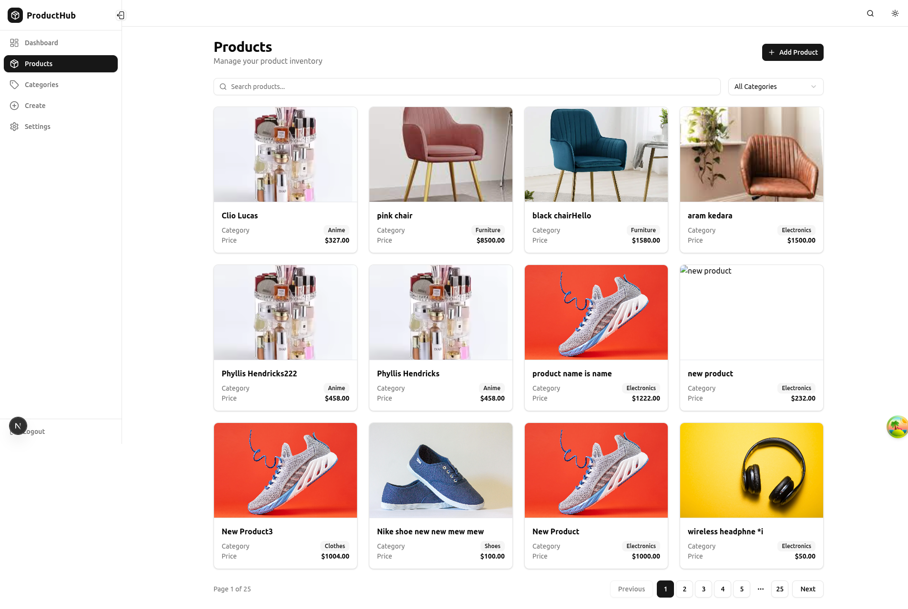

# ProductHub - Product Management Dashboard

A modern, full-stack product management dashboard built with Next.js, TypeScript, Redux Toolkit, and Tailwind CSS.

## Features

- **JWT Authentication** - Secure login with email-based authentication
- **Product Management** - Full CRUD operations for products
- **Search & Filter** - Real-time search with debouncing and category filtering
- **Pagination** - Client-side pagination for better performance
- **Responsive Design** - Fully responsive with collapsible sidebar
- **Form Validation** - Zod schema validation with inline error messages
- **Loading States** - Skeleton loaders for better UX
- **Error Handling** - Custom error pages (404, 500) with user-friendly messages
- **Toast Notifications** - Real-time feedback for user actions
- **Redux State Management** - Centralized state with Redux Toolkit

## Tech Stack

- **Framework**: Next.js 15 (App Router)
- **Language**: TypeScript
- **State Management**: Redux Toolkit & TanStack React Query
- **Data Fetching**: Axios & TanStack React Query
- **Styling**: Tailwind CSS v4
- **UI Components**: shadcn/ui
- **Form Validation**: Zod
- **Icons**: Lucide React

## Getting Started

### Prerequisites

- Node.js 18+ 
- pnpm

### Installation

1. Clone the repository:
```bash
git clone <your-repo-url>
cd product-management-dashboard
```

2. Install dependencies:
```bash
pnpm install
```

3. Run the development server:
```bash
pnpm run dev
```

4. Open [http://localhost:3000](http://localhost:3000) in your browser

## Usage

### Authentication

1. Navigate to the login page
2. Enter your email address (use the same email from your job application)
3. The app will authenticate with the BiTechX API and store the JWT token

### Managing Products

- **View Products**: Navigate to the Products page to see all products
- **Search**: Use the search bar to find products by name
- **Filter**: Filter products by category using the dropdown
- **Create**: Click "Add Product" to create a new product
- **Edit**: Click the edit icon on any product to update it
- **Delete**: Click the delete icon and confirm to remove a product
- **View Details**: Click the eye icon to see full product details

### Sidebar Navigation

- **Desktop**: Click the chevron button to toggle between full and icon-only sidebar
- **Mobile**: Sidebar automatically shows icon-only mode
- **Smooth Animations**: All transitions are smooth and responsive

## API Endpoints

The application uses a Backend-for-Frontend (BFF) pattern. The frontend communicates with Next.js API routes, which then call the external BiTechX API. This provides a layer of abstraction and security.

- **Internal API Routes (`/api/...`)**:
  - `POST /api/auth/login`
  - `GET, POST /api/products`
  - `GET, PUT, DELETE /api/products/:slug`
  - `GET /api/products/search`
  - `GET /api/categories`
  - `GET /api/categories/search`

- **External BiTechX API**: The internal routes proxy requests to the corresponding endpoints on `https://api.bitechx.com`.

## Project Structure

```
├── app/
│   ├── api/                # BFF API Routes (proxy to external API)
│   │   ├── auth/
│   │   ├── products/
│   │   └── categories/
│   ├── (auth)/
│   │   └── login/          # Login page
│   ├── (dashboard)/
│   │   ├── dashboard/      # Dashboard with stats
│   │   ├── products/       # Product pages (list, create, edit, detail)
│   │   ├── categories/     # Categories page
│   │   ├── analytics/      # Analytics placeholder
│   │   └── settings/       # Settings placeholder
│   ├── error.tsx           # Error boundary
│   ├── not-found.tsx       # 404 page
│   └── global-error.tsx    # Global error handler
├── components/
│   ├── providers/          # Context providers (Theme, Redux, Query)
│   ├── sidebar/            # Sidebar components
│   ├── products/           # Product-specific components
│   └── ui/                 # shadcn/ui components
├── hooks/
│   ├── use-app-query.ts    # Custom hook for useQuery
│   └── use-app-mutation.ts # Custom hook for useMutation
├── lib/
│   ├── axios.ts            # Axios instance for client-side fetching
│   ├── types.ts            # TypeScript types
│   ├── validations/        # Zod schemas
│   └── store/              # Redux store and slices
└── README.md
```

## Validation Rules

### Product Creation/Edit

- **Name**: Required, 3-250 characters
- **Description**: Required, at least 5 characters
- **Price**: Required, must be a number greater than 0
- **Category**: Required, must be a valid selection
- **Images**: Required, at least 1 valid URL

### Login

- **Email**: Required, must be valid email format

## Deployment

This app is ready to deploy on Vercel:

```bash
pnpm run build
```

Or click the "Publish" button in v0 to deploy directly to Vercel.

## License

MIT